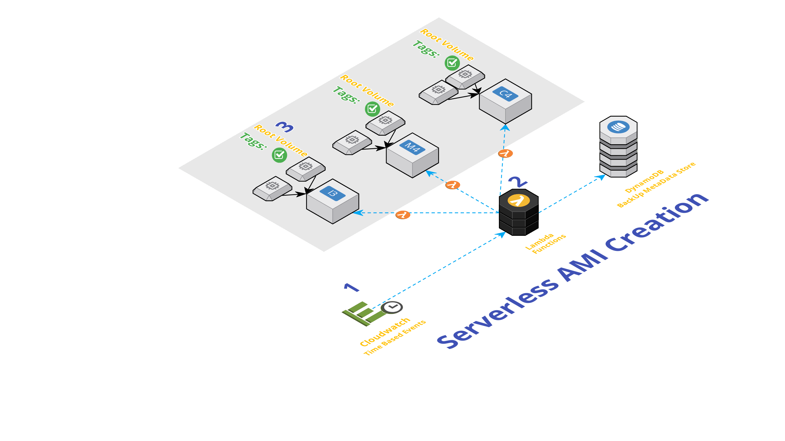

# Serverless AMI Baker
An Amazon Machine Image (AMI) provides the information required to launch an instance, which is a virtual server in the cloud.
You can launch multiple instances from a single AMI when you need multiple instances with the same configuration. You can use different AMIs to launch instances when you need instances with different configurations.

This lambda function will create AMI(Amazon Machine Images) of your instances and tag them for replication or auto deletion. You can customize it to make images of only your `running` instances.

You can also follow this article in **[Youtube](https://www.youtube.com/watch?v=U5nDPagdLPk&t=0s&list=PLxzKY3wu0_FKok5gI1v4g4S-g-PLaW9YD&index=23)**

## Pre-Requisities
We will need the following pre-requisites to successfully complete this activity,
- Few `Instances` with a Tag Key:`AmiBackUp` and Value as `Yes`
  - By default, both _running_ & _stopped_ instance AMI's are baked.
- IAM Role - _i.e_ `Lambda Service Role` - _with_ below mentioned policy

_The image above shows the execution order, that should not be confused with the numbering of steps given here_

## Step 0: IAM Policy
```
{
  "Version": "2012-10-17",
  "Statement": [
    {
      "Effect": "Allow",
      "Action": [
        "logs:*"
      ],
      "Resource": "arn:aws:logs:*:*:*"
    },
    {
      "Effect": "Allow",
      "Action": "ec2:Describe*",
      "Resource": "*"
    },
    {
      "Effect": "Allow",
      "Action": [
        "ec2:CreateImage",
        "ec2:DeregisterImage",
        "ec2:CreateSnapshot",
        "ec2:DeleteSnapshot",
        "ec2:CreateTags",
        "ec2:ModifySnapshotAttribute",
        "ec2:ResetSnapshotAttribute",
        "iam:Get*"
      ],
      "Resource": [
        "*"
      ]
    }
  ]
}
```

## Step 1 - Configure Lambda Function- `Serverless Janitor`
The below script is written in `Python 3.6`. Remember to choose the same in AWS Lambda Functions.
### Customisations
- _Change the global variables at the top of the script to suit your needs._
  - `globalVars['findNeedle']` - My Instances have tag `AmiBackUp`,
  
  - `globalVars['RetentionDays']` - Set the value you desire, by default it is set to 30 days
  
  - `globalVars['ReplicateAMI']` - If you want to use my _Serverless AMI Replicator_

- `Copy` the code from `serverless-ami-backup.py` in this repo to the lambda function
- `Increase` the lambda timeout acording to the number of instances and the size of each EBS volume. You could start with `60` seconds and then increasing or decreasing it based on your results, the default is `3` seconds.
- `Disable` retry attempts on asynchronous invocation (configure `maximum-retry-attempts` to 0). The default value is `2` , but is not recommended to this function because of his lack of idempotence.
- `Save` the lambda function

## Step 2 - Configure Lambda Triggers
We are going to use Cloudwatch Scheduled Events to take backup everyday.
```
rate(1 minute)
or
rate(5 minutes)
or
rate(1 day)
# The below example creates a rule that is triggered every day at 12:00pm UTC.
cron(0 12 * * ? *)
```
_If you want to learn more about the above Scheduled expressions,_ Ref: [CloudWatch - Schedule Expressions for Rules](http://docs.aws.amazon.com/AmazonCloudWatch/latest/events/ScheduledEvents.html#RateExpressions)

## Step 3 - Testing the solution
Start few Instance with the Tag Key`AmiBackUp` with Value as `Yes`

### Summary
We have demonstrated how you can automatically identify instances that require AMI Backup, create AMIs and tag them.

### Next Steps
You can use a serverless mechanism to replicate the AMI across Regions for Disaster Recovery. [Have a look at this video](https://www.youtube.com/watch?v=iujwfIPoEiM&list=PLxzKY3wu0_FKok5gI1v4g4S-g-PLaW9YD&index=3)
